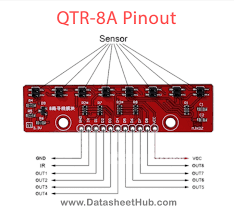

## IR 8 channel array (QTR8RC)

# Pinout with description
# Micro-controller interface pins for logic-level control
| Pin   | Function                                                                  |
|--------|---------------------------------------------------------------------------|
| VCC   | 5V logic power supply for the module                                      |
| GND   | Ground connection                                                         |
| RPWM  | PWM signal for forward rotation (Right PWM)                              |
| LPWM  | PWM signal for reverse rotation (Left PWM)                               |
| REN   | Enable signal for forward rotation (Right Enable)                        |
| LEN   | Enable signal for reverse rotation (Left Enable)                         |
| IS-R  | Current sense input for forward rotation (used for protection/monitoring)|
| IS-L  | Current sense input for reverse rotation                                  |

# Power and motor-control pins for high current side (Preferred wires with high resistance)
| Pin | Function                   |
|------|----------------------------|
| B+  | Battery positive terminal  |
| B-  | Battery negative terminal  |
| M+  | Motor positive terminal    |
| M-  | Motor negative terminal    |
